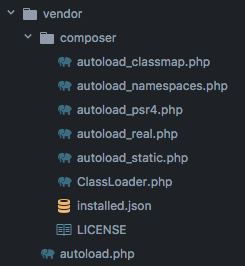

# Composer

Composer est un **gestionnaire de dépendances** pour PHP : c'est un outil qui gère le téléchargement et la mise à jour des "packages" utilisés pour un projet PHP, et l'**autochargement de classes et fichiers**.

Composer est un logiciel éxecutable, il s'installe sur votre machine et s'utilise en ligne de commande.
La configuration de Composer pour un projet donné, se fait dans un fichier qui doit être positionné à la racine, `composer.json`.

Les packages (dépendances) sont récupérés par Composer depuis le dépôt [packagist](https://packagist.org/).


## Installation

Composer est un `.phar`, un exécutable PHP. Une fois installé, il peut être utilisé directement en ligne de commande.

##### Téléchargement

Les instructions de [téléchargement](https://getcomposer.org/download/) de Composer indiquent les 4 lignes à exécuter en ligne de commande.

```
php -r "copy('https://getcomposer.org/installer', 'composer-setup.php');"
php composer-setup.php
php -r "unlink('composer-setup.php');"
```

Important : le numéro de hash à vérifier change à chaque nouvelle version. Si vous obtenez plusieurs fois de suite l'erreur "Installer corrupt", vérifiez bien la page officielle !

**Installation globale**

Afin de rendre composer disponible globalement (disponible depuis n'importe quel emplacement avec la commande `composer`)

```
sudo mv composer.phar /usr/local/bin/composer
```

## Usage

La [documentation de composer](https://getcomposer.org/doc/) est très complète (voir également les FAQ).

+ Commencer un nouveau projet
  Pour commencer à utiliser Composer sur un projet, il suffit d'initialiser ce fichier :
  - en utilisant l'assistant (voir plus bas `composer init`)
  - "à la main" en rédigeant le fichier puis en appelant `composer install` pour qu'il soit pris en compte,
  - ou en installant une première dépendance (voir plus bas `composer require`).

+ Utiliser Composer avec un projet existant
  Vous récupérez un projet, dont les dépendances sont définies à l'aide de Composer, et qui possède déjà un fichier `composer.json` :   
  - appeler `composer install` à la racine du projet pour télécharger les dépendances (dans votre dossier `vendor` local).

+ Développer
  - Installer une nouvelle dépendance (voir plus bas `composer require`)
  - Configurer l'autochargement des classes du projet (Voir plus bas "Autoload avec Composer et PSR-4")
  - Accéder aux classes du projet et des dépendances grâce à l'**auto-chargement** de Composer :  
    `require 'vendor/autoload.php';` au début du code de votre projet.

### Fichiers
Composer est configuré pour un projet dans le fichier `composer.json`.
Ce fichier listera toutes les informations du projet (créateur, nom, dépendances, classes ou fichiers à charger).

Les packages gérés à l'aide de Composer sont placés dans le dossier `vendor`.

**GIT : le fichier `composer.json` doit être partagé, PAS le dossier `vendor/` (ajouter une ligne `/vendor/` dans le fichier `.gitignore`)**  

#### Le fichier `composer.json`
Permet de configurer plusieurs aspects du projet :
+ des informations sur le "root package" (votre projet) : nom, description, auteurs, version...
+ la liste des dépendances : require et require-dev
+ les autres fichiers à auto-charger : classes de votre projet (selon la norme psr-0 ou psr-4), autres classes, fichiers...
Voir [la doc complète à propos de `composer.json`](https://getcomposer.org/doc/04-schema.md)

Lorsque vous modifiez ce fichier, ne pas oublier d'appeler `composer install` pour que les modifications soient prises en compte par Composer.

#### Définir une nouvelle dépendance
La liste des dépendances est spécifiée dans l'entrée "require" du `composer.json` :
```
"require": {
    // ... ,
    "league/plates": "3.*"
}
```

#### Configurer l'autochargement avec Composer et PSR-4
L'**autoload** de classes du projet (rangées dans un ou plusieurs **namespace**), doit être configuré dans le fichier `composer.json` :

```
"autoload": {
  "psr-4": {
    "ProjetGenial\\": "src/"
  }
}
```
Composer se chargera d'aller chercher les classes à partir de ce point de départ et "comprendra" que ce point de départ correspond à un namespace particulier. **Ici le namespace 'ProjetGenial' est relié au dossier 'src/'**

:warning: Pour que cette configuration soit prise en compte, il faut relancer la commande `composer dump-autoload` dans le projet.

### Initialiser un projet : `composer init`

Cette commande permet de créer le fichier `composer.json` avec un assistant (en ligne de commande)

```
composer init
```
La commande proposera de multiples options de configuration, puis génèrera le fichier.

```
Welcome to the Composer config generator

Package name (<vendor>/<name>) [whoami/projet]: ...
Description []: ...
Author [Who Ami <whoami@domain.ltd>, n to skip]: ...

...

Define your dependencies.

Would you like to define your dependencies (require) interactively [yes]? ...

{
    "name": "whoami/projet",
    "require": {}
}

Do you confirm generation [yes]? ...

```

Le fichier généré sera donc

```json
{
    "name": "whoami/projet",
    "require": {}
}
```

### Ajouter une dépendance : `composer require who/package`

Permet d'ajouter une dépendance à Composer.

> Exemple avec le package plates (système de templating)

```
composer require league/plates

...

Using version ^3.3 for league/plates
./composer.json has been updated
Loading composer repositories with package information
Updating dependencies (including require-dev)
Package operations: 1 install, 0 updates, 0 removals
  - Installing league/plates (3.3.0): Downloading (100%)
Writing lock file
Generating autoload files
```

Le package est ajouté aux dépendances dans le fichier `composer.json`

```
    "require": {
    	...
        "league/plates": "3.*"
    }
```

et Composer installera ce package dans le dossier `vendor/`.

### `composer install`

La commande `install` demande à Composer de parcourir le fichier `composer.json` afin d'installer les pré-requis du projet.
C'est la commande

_remarque : même si aucune dépendance n'est précisée, `composer install` créera un dossier `vendor/` et un fichier `autoload.php`._

```
composer install
```



## Annexes

### Erreur: Allowed memory size

On lance un `composer install`, un `composer create-project` ou un simple `composer update` et là l'erreur qui fait peur :
```
PHP Fatal error:  Allowed memory size of 134217728 bytes exhausted (tried to allocate 9437184 bytes) in phar:///usr/local/bin/composer/src/Composer/Repository/ComposerRepository.php on line 565
```

**Que dit elle ?**

En gros composer n'a pas suffisament de mémoire disponible pour réaliser l'opération qu'on lui demande. Une erreur classique en somme ! Nous avons la même chose sur nos gros script PHP. 

Lorsque cela nous arrive, un simple `ini_set('memory_limit', '512M');` suffit en haut de notre script _(il est possible de mettre `-1` en valeur. Pour plus d'info: [Manuel PHP](http://php.net/manual/fr/ini.core.php#ini.sect.resource-limits))_.

**Les solutions**

Que dit la [doc de composer](https://getcomposer.org/doc/articles/troubleshooting.md#memory-limit-errors) ? 

  * Augmenter le memory limit dans le php.ini
     * Editer le fichier `php.ini` avec la commande: `sudo nano /etc/php/7.2/cli/php.ini`. Trouver la ligne `memory_limit = ` et mettre la valeur souhaitée (généralement `-1`).
     * Le principal défaut de cette méthode est que l'intégralité de vos scripts en bénéficieront _(c'est une solution générique)_.
  * Définir une variable d'environnement
    * Entrer dans votre terminal la commande suivante: `export COMPOSER_MEMORY_LIMIT=-1`
    * D'après la doc de composer, celui-ci cherche la variable d'environnement `COMPOSER_MEMORY_LIMIT` afin de réaliser son `ini_set('memory_limit', ...`. Cette solution est spécifique à composer.

### Erreur: Timeout lors de l'installation

Quand on lance `composer install`, il ne se passe rien pendant plusieurs minutes, puis on obtient le message d'erreur suivant : 
```The "https://getcomposer.org/version" file could not be downloaded: failed to
open stream: Operation timed out
```

**La solution**

Cette erreur apparaît en cas de mauvaise configuration de l'IPV6 sur la VM. Elle peut être résolue en tapant cette commande (voir [doc](https://getcomposer.org/doc/articles/troubleshooting.md#operation-timed-out-ipv6-issues-)) : 
```
sudo sh -c "echo 'precedence ::ffff:0:0/96 100' >> /etc/gai.conf"
```

### Erreur: proc_open(): fork failed errors

Généralement cela se produit sur notre serveur. On lance un `composer require/update/upgrade...` et là l'erreur qui fait peur: 
```
PHP Fatal error: Uncaught exception 'ErrorException' with message 'proc_open(): fork failed - Cannot allocate memory' in phar
```

**Que dit elle ?**

En gros, il n'y a plus de mémoire de disponible sur votre serveur !

**La solution**

Que dit la [doc de composer](https://getcomposer.org/doc/articles/troubleshooting.md#proc-open-fork-failed-errors) ?

On va temporairement créer un swap (une mémoire située sur le disque dur) pour augmenter la taille de notre mémoire:

```
sudo /bin/dd if=/dev/zero of=/var/swap.1 bs=1M count=1024
sudo /sbin/mkswap /var/swap.1
sudo /sbin/swapon /var/swap.1
```
