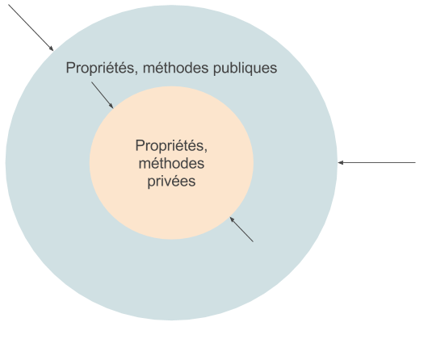

# Les objets en PHP

## Historique, naissance, concept

Dans les années 1960, **la programmation structurée** se développe avec l'informatique. Ce type de programmation utilise les structures de contrôles _while, repeat, for, if .. then .. else_ et les _fonctions_ (appelées également _procédures_). On utilise les langages de programmation procéduraux (dont PHP fera partie bien plus tard). On parle alors de **programmation procédurale**, soit l'enchaînement de portions de code et des appels à des fonctions, qui peuvent elles-mêmes appeler d'autres fonctions.

Avant l'invention de l'orienté objet, certains projets ne pouvaient plus fonctionner avec ces méthodes. **La programmation orientée objet** a été créée (dans les années 1980 et 1990) pour dépasser certaines barrières techniques. Elle a prit les meilleures idées de la programmation structurée et les a combinées avec plusieurs nouveaux concepts. Le résultat donna une nouvelle façon d'organiser son programme. 

On peut résumer ainsi deux types d'organisation d'un programme :

- **Autour du code** (ce qui se passe) : **programmation structurée/procédurale**.
- **Autour de la donnée** (ce qui est affecté) : **programmation orientée objet**.

> "Data first" vs "Code first" : la POO travaille autour de la donnée. L'idée principale est que la donnée contrôle l'accès au code. Dans un langage orienté-objet, nous définissons la donnée et les fonctions qui ont la permission d'agir sur cette donnée. Ainsi, un type de donnée définit précisément quelles sortes d'opérations peuvent être appliquées à ces données.

Pour supporter le principe de la programmation orientée objet, tous les langages supportant POO ont 3 traits en commun :

- L'encapsulation (voir plus bas)
- L'héritage
- Le polymorphisme

> Nous détaillerons les deux derniers dans la fiche récap' suivante.

## Les avantages de la POO

* Clarté fonctionnelle du code.
* Protège la cohérence des données et des traitements.
* Modulaire.
* Réutilisable.

> La POO est une approche par entités, avec leur contexte, leurs données, leurs méthodes.

## Qu'est ce qu'un objet ?

### Objet
Représentation d'une entité matérielle ou immatérielle qui possèdes des propriétés (données) ou actions (code, méthodes). *Quelques exemples : une personne, un animal, un élève, un compte bancaire, une requête en base de données.*

### Attribut
Caractère propre à un objet : on parle aussi de ses "propriétés".
*Exemple : une personne possède différents attributs : son nom, sa date de naissance, ses coordonnées, ..., un compte bancaire : montant disponible, numéro de compte, ..., une requête en base de données : la chaîne de la requête.*

### Méthode
Une méthode est une action appliquable à un objet.
*Exemple : manger, dormir, parler, ..., créditer, débiter, afficher le solde, ..., préparer une requête, lier un paramètre, exécuter la requête, retourner le résultat.*

### Classe
Modèle qui définit la structure d'un objet, ses attributs, ses méthodes. Les objets sont créés ("instanciés") à partir de ce modèle. Ils ont pour **type** le nom de la classe à partir de laquelle ils sont créés.
*Exemple : Jacques, François, Emmanuel, Jean-Luc sont des Personnes. Elles disposent d'un nom, d'un âge, ..., peuvent marcher, manger, dormir.*

## Définition et utilisation

### Définition d'une classe en PHP

**class**

```php
// fichier MyClass.php
// le nom d'une classe s'écrit en PascalCase
// On définit une classe par fichier qui est nommé comme la classe

class MyClass
{
    // Propriété/Attribut/Donnée
    private $property;

    // Méthode/Action/Code
    public function myMethod()
    {
        // ...
    }
}
```

### L'instanciation

Créer une instance (un objet) de la classe *MyClass* avec **new** :

```php
$instance = new MyClass();
```
`$instance` est un objet de classe MyClass.


### Les attributs

Déclarer les attributs d'une classe :

```php
class Person
{
    public $name = "John Doe";
}
```

Utiliser (lire, assigner une valeur) :

```php
$instance = new Person();

echo $instance->name; // John Doe

$instance->name = "Michaël Jackson";

echo $instance->name; // Michaël Jackson
```

> Opérateur objet (object operator)  : `->`

### Les méthodes

Déclarer les méthodes d'une classe :

```php
class Person
{
    public $name = "John Doe";

    public function hello()
    {
        echo "Oh, hello!";
    }
}
```

Appeler (éxécuter) une méthode publique :

```php
$anonymous = new Person;

echo $anonymous->name; // John Doe

$anonymous->hello();
```

### $this

Variable accessible *dans le contexte de l'objet*, référence à l'objet lui-même :

```php
class Person
{
    public $name = "John Doe";

    public function hello()
    {
        echo "Oh, hello, my name is " . $this->name;
    }
}
```

### Visibilité

* `public` autorise l'accès direct aux propriétés et aux méthodes de l'objet depuis "l'extérieur".
* `private` l'interdit : les propriétés et les méthodes de l'objet sont accessibles uniquement depuis le contexte interne de l'objet.

#### Encapsulation

En programmation, l'encapsulation désigne le principe de regrouper des données avec un ensemble de méthodes permettant de les lire ou de les manipuler, empêchant l'accès aux données par un autre moyen que les services proposés. L'encapsulation permet donc de garantir l'intégrité des données contenues dans l'objet.



> Toujours préférer `private` quand c'est possible, pour préserver l'encapsulation, le contrôle d'accès aux données de l'objet.

```php
class Person
{
    private $secret = "Ceci est un secret";

    public function showSecret()
    {
        return $this->secret;
    }
}

$dude = new Person;

echo $dude->showSecret(); // Ceci est un secret
echo $dude->secret; // Fatal Error
```

### Getters et Setters (accesseurs et mutateurs)

Méthodes standard qui permettent un accès contrôlé aux propriétés privées.

#### Définition manuelle

```php
class Person {
    // Propriété
    private $secret = 123;

    // Getter
    public function getSecret()
    {
      return $this->secret;
    }

    // Setter
    public function setSecret($newSecret)
    {
      // Contrôle sur la donnée fournie
      if(is_int($newSecret)) {
        // Modification de la propriété
        $this->secret = $newSecret;
      }
    }
}
```

#### Méthodes magiques PHP

`__get` et `__set`

```php
class Person
{
    private $secretCode = 123;
    private $age;

    public function __get($property)
    {
        // on veut bien partage age
        if( "age" == $property) {
            return $this->age;
        }

        // mais pas secretCode
        elseif ("secretCode" == $property) {
            echo "propriété privée";
        }

        else {
            echo "propriété n'existe pas";
        }
    }

    public function __set($property, $value)
    {
        if("age" == $property && is_int($value)) {
             $this->age = $value;
        }

        elseif ("secretCode" == $property) {
            echo "c'est mon secret, pas touche."
        }

        else {
            echo "propriété ou valeur invalide";
        }
    }
}
```

### Constructeur et destructeur

Méthodes magiques d'un objet qui sont appelées automatiquement à l'instanciation / la destruction de l'objet (`unset` ou fin de script).

Déclarer le contructeur n'est pas obligatoire mais cela permet d'éxécuter certaines actions à l'instanciation: initialiser les valeurs.

```php
class MyClass
{
    private $config;

    public function __construct($config)
    {
        $this->config = $config;
    }

    public function getConfig($name)
    {
        if(isset($this->config[$name])) {
            return $this->config[$name];
        }
    }

    public function __destruct() {
        // ...
    }
}
```

### Méthodes et propriétés statiques

Les méthodes et propriétés statiques sont partagées par toutes les instances, et accessibles directement à partir du nom de la classe.

**statique == de classe**  


* Paamayim Nekudotayim (opérateur de résolution de portée) : `::`  Précède les propriétés et méthodes statiques.  

* `self` : Désigne la classe en cours.

```php
class Person
{
  private $age;

  // propriété statique
  private static $majority;

  // constante de classe
  // (sans $, en majuscule par convention)
  const DEFAULT_NAME = "John Doe";

  // méthode statique
  public static function getMajority()
  {
      return self::$majority;
  }

  public static function setMajority($nb)
  {
      if(is_int($nb))
          self::$majority = $nb;
  }
}

echo "le nom par défaut d'une personne est " . Person::DEFAULT_NAME;

Person::setMajority(18);

echo "En France, l'âge de la majorité est " . Person::getMajority();
```
---

## Sources

- [Article sur SUPINFO](https://www.supinfo.com/articles/single/2603-programmation-orientee-objet)
- [Programmation structurée sur Wikipédia](https://fr.wikipedia.org/wiki/Programmation_structur%C3%A9e)
- [Programmation procédurale sur Wikipédia](https://fr.wikipedia.org/wiki/Programmation_proc%C3%A9durale)
- [Programmation objet sur Wikipédia](https://fr.wikipedia.org/wiki/Programmation_orient%C3%A9e_objet)

## Aller plus loin

- [Héritage et polymorphisme](heritage.md)

## Ressources

- [Cheat Sheet complète](https://www.logicbig.com/tutorials/misc/php/php-oop-cheat-sheet.html)
- [Cheat Sheet concise en PDF, jolie](https://speakerdeck.com/doctorchicha/object-oriented-php-cheat-sheet)
